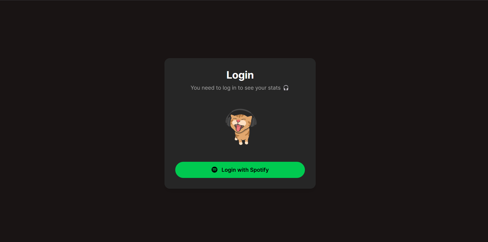
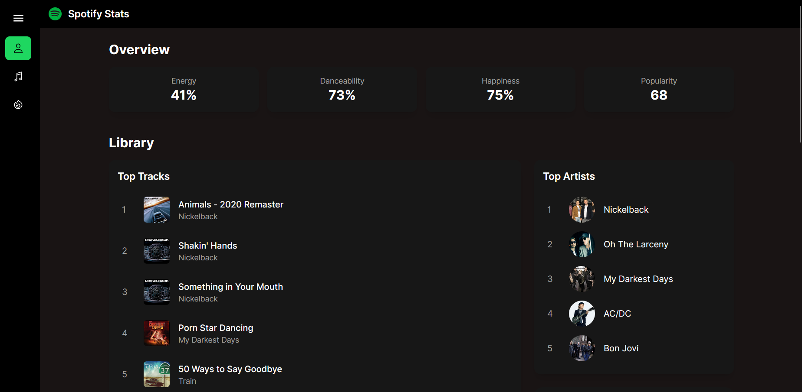
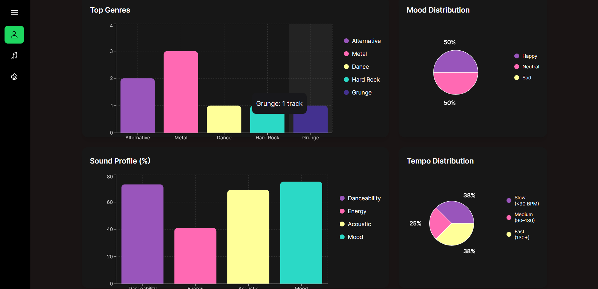
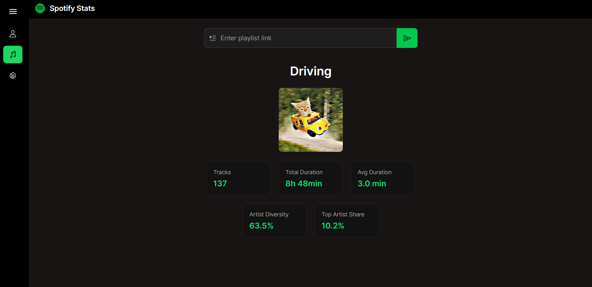
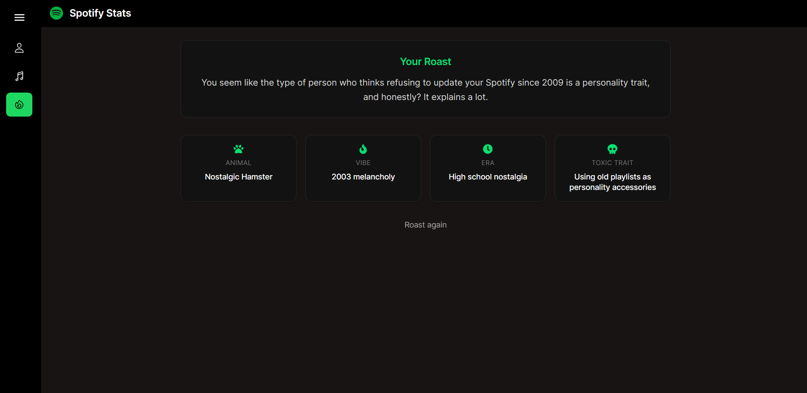

# Spotify Stats

## Overview

Spotify Stats is a web application that analyzes a user's Spotify data to generate insights about their music taste. It combines data from the **Spotify Web API** and an external API (**SoundStat**) to provide enriched analytics, visualizations, and an AI-generated "roast" of the user's music preferences.

The project follows data science principles such as data extraction, processing, aggregation, and visualization.

---

## Features

- Spotify OAuth login
- User profile data retrieval
- Top tracks and top artists analysis
- Playlist analysis (custom input)
- Genre and decade distribution
- Audio feature analysis (energy, danceability, valence, etc.)
- KPI summaries (averages and metrics)
- Interactive visualizations (charts and graphs)
- AI-generated music taste roast

---

## Tech Stack

### Frontend

- React (Vite)
- Charts / data visualization libraries
- Spotify-inspired UI

### Backend

- Flask (Python)
- REST API architecture
- Spotify Web API
- SoundStat API (audio features)
- Ollama (AI roast generation)

---

## Example Screens

### Login

### Profile Overview

### Library & Analytics

### Playlist Analysis

### AI Roast

